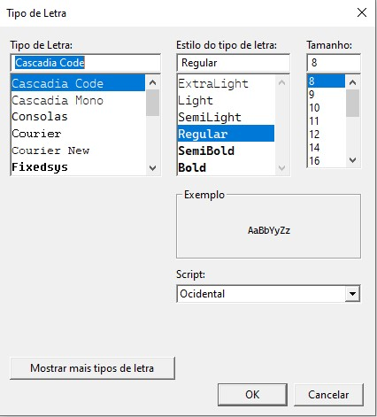
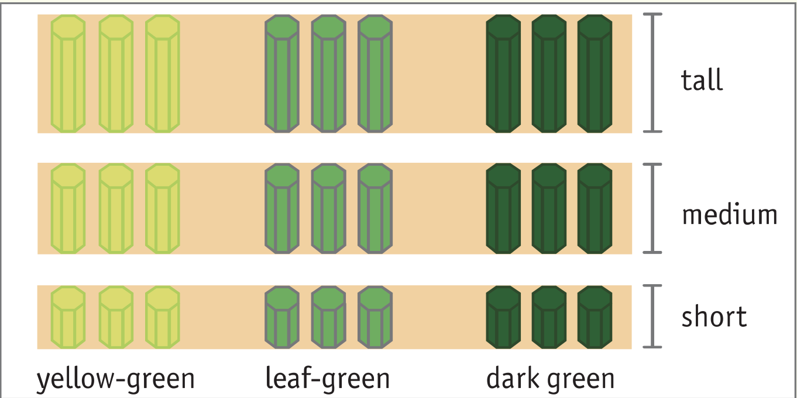
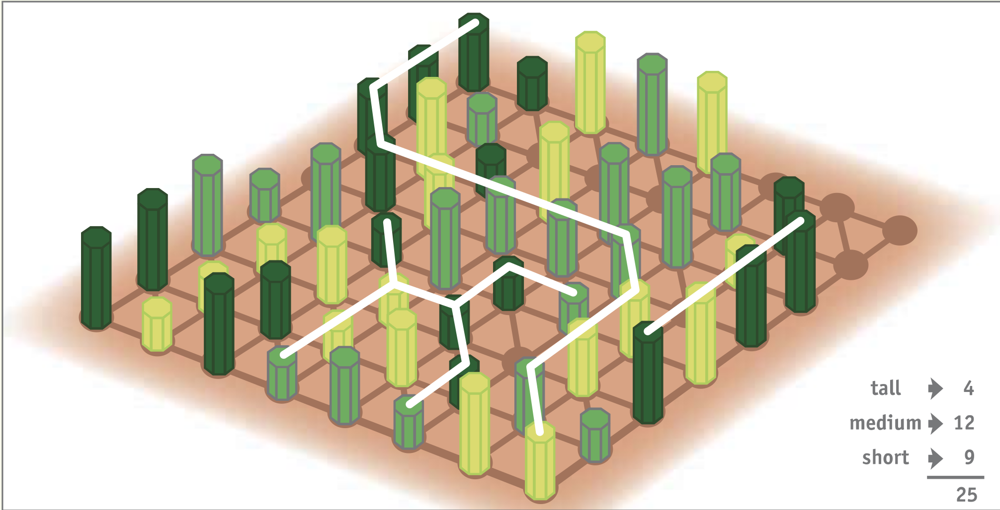

#  Turma 5- Wald Meister_5

  

##  Index

- [Group](#group-and-contributions)

- [Installation and Execution](#installation-and-execution)

- [Linux](#linux)

- [Windows](#windows)

- [Wald Meister - Introduction and Rules](#wald-meister---introduction-and-rules)

- [Game Components](#game-components)

- [How to Play](#how-to-play)

- [Objective](#objective)

- [Ending and Scoring](#ending-and-scoring)

- [Helpful links](#helpful-links)

- [Logic of the game](#logic-of-the-game)

- [GameState](#representation-of-the-gamestate)

- [Trees](#representation-of-trees-and-coordinates)

- [Display](#display)

- [Value of the board](#value-of-the-board)

- [Bot Move Choice](#bot-move-choice)

- [Move Validation and Execution](#move-validation-and-execution)

- [End of game](#end-of-game)

- [Conclusions](#conclusions)


##  Group and Contributions

- Tomás Alexandre Torres Pereira (up202108845@edu.fe.up.pt), contribution -> 50%

- Tomás Miranda de Figueiredo Sarmento (up202108778@edu.fe.up.pt), contribution -> 50%

  

##  Installation and Execution

  

###  Linux

1. Clone the repository to your local machine using SSH:

```shell

git clone  git@github.com:elliothacker33/Waldmeister-board-game.git

```

  

or using HTTPS:

```shell

git clone  https://github.com/elliothacker33/Waldmeister-board-game.git

```

  

2. Navigate to the downloaded directory and open sicstus:

```shell

cd  Waldmeister-board-game/src

sicstus

```

  

3. Load the game in sicstus:

```prolog

consult('waldmeister.pl').

```

  

4. Start the game:

```prolog

play.

```

  

###  Windows

1. Clone the repository to your local machine using SSH:

```shell

git clone  git@github.com:elliothacker33/Waldmeister-board-game.git

```

  

or using HTTPS:

```shell

git clone  https://github.com/elliothacker33/Waldmeister-board-game.git

```

  

2. Navigate to the downloaded directory and open sicstus:

```shell

cd  Waldmeister-board-game/src

sicstus.exe

```
3. Change the font and size

  

4. Load the game in sicstus:

```prolog

consult('waldmeister.pl').

```

  

5. Start the game:

```prolog

play.

```

  
  

##  Wald Meister - Introduction and Rules

  

**Wald Meister** is a board game with a tree nursery theme. In this game, players repeatedly replant trees before transferring them to a larger forest, where strong roots are crucial for their survival.

  

###  Game Components

  

Wald Meister consists of a total of 54 trees. Each player uses 27 trees. The trees come in three different heights and three different colors. Each player receives three pieces per color and per height.

  



  

###  How to Play

  

1.  **Starting the Game**: Choose the starting player arbitrarily. The first player places their tree piece on the board.

2.  **Relocating Trees**: The second player can then relocate this piece by moving it in a straight line. After that, the second player places their own piece in the vacant spot from which they removed the last piece. This process can be repeated until the end of the game is reached.

3.  **Fixed Pieces**: A piece becomes "fixed" when it is surrounded on all sides, making it impossible to move. Fixed pieces are valuable for building strong clusters that cannot be disrupted by the opponent.

4.  **Clusters**: A cluster is a group of pieces of the same height or color that are adjacent or connected without being separated by pieces of different color, height, or empty spaces.

  

###  Objective

  

The game's objective varies for each player:

  

- One player aims to form clusters of trees of the same color (three colors available).

- The other player aims to form clusters of trees of the same height (three heights available).

  

###  Ending and Scoring

  

The game ends when all the pieces have been placed on the board. Players must then calculate their points. One player should count the points for the largest cluster in each color, while the other player counts the points for the largest cluster in each height. To determine the winner, add up the points for the three largest clusters for each player, with each piece in a cluster counting as one point.

  



###  Helpful links

- [Rulebook](https://boardgamegeek.com/filepage/249274/rules-waldmeister): Download the comprehensive rulebook for Wald Meister.

- [Official Website](https://www.spielewerkstatt.eu/gb/strategy-tactics/204-forestmeister.html): Browse the official website of the game and buy the game.

  
  

###  Logic of the Game

  

####  Representation Of The GameState

  

The Gamestate is and argument essential for almost all functions in this game and it consists of 5 variables:

-  **Board**

The board of the game in wich it represents the pieces in place in pairs with the acording height and color and there is -1 in the position where there isnt any piece.

  

-  **Trees1**

The Trees1 is a list of the trees that player 1 has at it's disposal to play as well has it's number.

-  **Trees2**

The Trees2 is a list of the trees that player 2 has at it's disposal to play as well has it's number.

  

-  **Amount**

The variable Amount it is the amount of pieces available to be played in the game. It will go from 54 to 0.

  

-  **Turn** 

The variable Turn can be 1 or 2 depending of what player is playing.


-  **Examples of GameState**

   Example for default size.

-  **Initial**

  [[[-1],[-1, -1],[-1, -1, -1],[-1, -1, -1, -1],[-1, -1, -1, -1, -1],[-1, -1, -1, -1, -1, -1],[-1, -1, -1, -1, -1, -1, -1],
  [-1, -1, -1, -1, -1, -1, -1, -1],[-1, -1, -1, -1, -1, -1, -1],[-1, -1, -1, -1, -1, -1],[-1, -1, -1, -1, -1],[-1, -1, -1, -1],[-1,-1,-1],[-1,-1],[-1]],[(1-1,3),(1-2,3),(1-3,3),(2-1,3),(2-2,3),(2-3,3),(3-1,3),(3-2,3),(3-3,3)],[(1-1,3),(1-2,3),(1-3,3),(2-1,3),(2-2,3),(2-3,3),(3-1,3),(3-2,3),(3-3,3)],54,1]

  

-  **Intermediate**
[[[-1],[-1, 1-1],[-1, 3-1, -1],[-1, -1, -1, -1],[-1, -1, -1, -1, -1],[-1, -1, -1, -1, -1, -1],[-1, -1, -1, -1, -1, -1, -1],
  [-1, -1, -1, -1, -1, -1, -1, -1],[-1, -1, -1, -1, -1, -1, -1],[-1, -1, -1, -1, -1, -1],[-1, -1, -1, -1, -1],[-1, -1, -1, -1],[-1,-1,-1],[-1,-1],[-1]],[(1-1,2),(1-2,3),(1-3,3),(2-1,3),(2-2,3),(2-3,3),(3-1,3),(3-2,3),(3-3,3)],[(1-1,3),(1-2,3),(1-3,3),(2-1,3),(2-2,3),(2-3,3),(3-1,2),(3-2,3),(3-3,3)],52,1]
  

-  **Final**
- [[[3-1],[1-1, 1-1],[-1, 3-1, -1],[2-2, 2-2, 2-2, 1-1],[3-3, -1, -1, -1, -1],[2-2, 2-2, 2-2, 3-1, 3-1, 3-1],[3-2, 3-2, 3-2, 3-2, 3-2, 3-2, 2-1],
  [1-3, 1-3, 1-3, 1-3, 1-3, 1-3, 2-3, 2-3],[1-2, -1, 1-2, 1-2, 1-2, -1, -1],[2-1, 2-1, 2-1, 2-1, 2-1, 3-3],[2-3, 2-3, 2-3, 2-3, -1],[3-3, 3-3, 3-3, 3-3],[1-2,-1-2,-1-1],[1-1,1-1],[3-1]],[(1-1,0),(1-2,0),(1-3,0),(2-1,0),(2-2,0),(2-3,0),(3-1,0),(3-2,0),(3-3,0)],[(1-1,0),(1-2,0),(1-3,0),(2-1,0),(2-2,0),(2-3,0),(3-1,0),(3-2,0),(3-3,0)],0,_]

####  Representation of Trees and Coordinates

The representation of both trees and coordinates consists of a pair in the form of X-Y.

  

#####  Trees (Height-Color)
  Trees can be represented by all combinations Height-Color (1-1 ... 3-3) .
- 1: Height --> small size , Color --> light green 

- 2: Height --> medium size , Color --> medium green

- 3: Height --> big size , Color --> dark green

  
#### Display
We used a lot of functions to draw the components nedded for this game i will talk about the more important ones.
- Drawing the board is a complex task given that our board have an unsual size and variable size i will show the main functions use to draw the board in this function we use draw_matrix(+Matrix) to add some components needed to the board aside from the board it self like coluns or lines if needed and could help in future developement
```prolog

draw_matrix([]).
draw_matrix(Matrix):-
    get_size(Matrix,Size),
    write('\nL\n'),
    draw_matrix_aux(Size,1,Matrix).
        
/* 
    this function is and axiliary function to draw the board
*/
% draw_matrix_aux(+Size,+NColumn,+Matrix)        
    draw_matrix_aux(_,_,[]).
            
    draw_matrix_aux(Size,NColumn,[Head | Tail]):-
        NColumn =< Size,
        Blanks is Size - NColumn,
        NColumn1 is NColumn + 1,
        draw_matrix_aux2(NColumn,Blanks,Head),
        draw_matrix_aux(Size,NColumn1,Tail).
            
    draw_matrix_aux(Size,NColumn,[Head | Tail]):-
        NColumn > Size,
        Blanks is NColumn - Size,
        NColumn1 is NColumn + 1,
        draw_matrix_aux2(NColumn,Blanks,Head),
        draw_matrix_aux(Size,NColumn1,Tail).
```
- this function is used to add filler to deal with the weird size of our board
```prolog
add_blancks(0,Result,Result).
add_blancks(Blanks,Column,Result):-
    append([0],Column,NewColumn),
    NewBlanks is Blanks - 1,
    add_blancks(NewBlanks,NewColumn,Result).
```

 - draw_matrix_aux2 is used to draw each line of the board given that each line of the matrix of the board needs to have fillers placed according to the size of the matrix as well as each line of the matrix of the board are equal to 3 lines in the terminal so this function works as a translation layer

 ```prolog
 draw_matrix_aux2(NColumn,Blanks,Head):-
    NColumn < 10,
    add_blancks(Blanks,Head,NewHead),
    draw_line_with_pieces(NewHead,[[],[],[]],[Line1,Line2,Line3]),
    append([' '],Line1,NewLine1),
    append([NColumn],Line2,NewLine2),
    append([' '],Line3,NewLine3),
    draw_line(NewLine1),
    draw_line(NewLine2),
    draw_line(NewLine3),write('\n').
        
draw_matrix_aux2(NColumn,Blanks,Head):-
    10 =< NColumn,
    add_blancks(Blanks,Head,NewHead),
    draw_line_with_pieces(NewHead,[[],[],[]],[Line1,Line2,Line3]),
    append(['  '],Line1,NewLine1),
    append([NColumn],Line2,NewLine2),
    append(['  '],Line3,NewLine3),
    draw_line(NewLine1),
    draw_line(NewLine2),
    draw_line(NewLine3),write('\n').
 ```

 - This function draws the fragments of a line in the terminal

 ```prolog
draw_line([]):-
        write('\n').

draw_line([Head | Tail]):-
    number(Head),!,
    write(Head),
    draw_line(Tail).

draw_line([Head | Tail]):-
    format(Head,[]),
    draw_line(Tail).
 ```
 - For each piece in a line it calls the draw piece wich is diferent from each piece
 ```prolog
draw_line_with_pieces([],Lines,Lines).
        
draw_line_with_pieces([Head | Tail],Lines,Result):-
    draw_Piece(Head,Lines,NewLines),
    draw_line_with_pieces(Tail,NewLines,Result).
 ```
 - this function is diferent for each piece there are two examples 
the Colors are light green &#9651; green &#9709; Dark green &#9650;
And the heights are represented by one triangle if the trees are smal or two triagles if the trees are medium or three trees is they are tall
 ```prolog
 %draw blank
 draw_Piece(0,[Tail1,Tail2,Tail3],[NewTail1,NewTail2,NewTail3]):-
    append(Tail1,['   '],NewTail1),
    append(Tail2,['   '],NewTail2),
    append(Tail3,['   '],NewTail3).
%draw place without piece yet
draw_Piece(-1,[Tail1,Tail2,Tail3],[NewTail1,NewTail2,NewTail3]):-
    append(Tail1,['    _ '],NewTail1),
    append(Tail2,['   / \\'],NewTail2),
    append(Tail3,['   \\_/'],NewTail3).
%draw a piece
draw_Piece(1-1,[Tail1,Tail2,Tail3],[NewTail1,NewTail2,NewTail3]):-
    append(Tail1,['    _ '],NewTail1),
    append(Tail2,['   /\x25b3\\\'],NewTail2),
    append(Tail3,['   \\_/'],NewTail3)
.
 ```

####  Value of the Board

Our game has special way to count to count the poinst depending if u win writh colors or heights u count de number of pieces with the biggest peices from every color/height type and sum it we use 3 main functions to resolve this problem we will show an example of the values function of color its the same but with height in the heights functions

  

- we used a bfs color_bfs(+Board,+Size,+Queue,+Visited,-NewVisited,+Color,+CurrMax,-CurrMax) that gets all the pieces with the same height/color near the first position that is given in the Queue when its called this returns the number of pieces with the same height/color containing the first piece that are a near each other

```prolog

color_bfs_aux(_,_,[],Visited,Visited,_,Max,Max).

  

color_bfs_aux(Board,Size,[Line-Col | Rest],Visited,NewVisited,Color,Current_Max,Max):-

findall(Cords, (getPositionNear(Size,Line,Col,Cords), Cords\= null,\+ member(Cords,Visited),\+ member(Cords,Rest), getPiece(Board,Cords,_Height-Color)),

New_Cords),

append(Rest,New_Cords,New_queue),

NewMax is Current_Max + 1,

color_bfs_aux(Board,Size,New_queue,[Line-Col | Visited],NewVisited,Color,NewMax,Max).

  

```

  

- using the previous function what we can do is using funtion **next_position_color** that gets the next cordinates of the piece of the board with the color/height expecified and not are not list visited geting the start of the next group of pieces, comparing each time the process is done with the current max and the max calculated we get the bigger and with that we return the bigger value calculanting for a certant board and color/height the group with the biggest number of pieces together

  

```prolog

color_bfs(Board,_,Visited,Color,CurrMax,CurrMax):-

next_position_color(Board,Visited,Color,Cord),

Cord == null.

  

color_bfs(Board,Size,Visited,Color,CurrMax,Max):-

next_position_color(Board,Visited,Color,Cord),

Cord \= null,

color_bfs_aux(Board,Size,[Cord],Visited,NewVisited,Color,0,TmpMax),

(TmpMax < CurrMax ->

color_bfs(Board,Size,NewVisited,Color,CurrMax,Max);

color_bfs(Board,Size,NewVisited,Color,TmpMax,Max)

).

```

- In this step we use this function to check all 3 colors ((dark green : 1 , medium green : 2 , light green : 1)) and sum to get the values

```prolog

count_color_values(Board,Max):-

get_size(Board,Size),

color_bfs(Board,Size,[],1,0,Max1),

color_bfs(Board,Size,[],2,0,Max2),

color_bfs(Board,Size,[],3,0,Max3),

Max is Max1 + Max2 + Max3.

```

  
  

####  Bot Move Choice

-  **Bot Generic behaviour**

the function choose_move(+Gamestate, +Player, +Dificulty, -Mov) is standard among all bots but they have slight differences our game is a bit special one move is actual two, and our initial move is diferent and doesnt have a gready approch possible because that approch is only feasible when there are pieces in the board one move consist in trading a piece with one of the player and using the piece that was removed from the board to move in one of the available paths but in the start we dont have any piece to replace so the first move is choosing a random position and placing a piece there and then the second player chooses a random valid position and move the piece there.

```prolog

choose_move([_Board, _Trees1, _, _ , _], 1, 1, (ValidMoves,_Tree,Coordinates)):-

random_member(Coordinates, ValidMoves)

.

choose_move([_Board, _,_Trees2, _ , _], 2, 1, (ValidMoves,_Tree,Coordinates)):-

random_member(Coordinates, ValidMoves)

.

```

  

-  **BotEasy**

- We had to be creative to adder in the context of our game and keep it efficient in the mov our this (TreesInBoard,Tree,Coordinates,NewCoordinates,NewTree) the **TreesInBoard** is input from the function as well and it is the Trees in board that can be moved, the **Tree** is the piece from the board that is moved ,**Cordinates** are the cordinates of the piece moved, the **NewCoordinates** are the new coordinates of the piece moved and the **NewTree** is the piece that will be place in the **Coordinates** of the piece moved.

<bl>

<bl>

- This function chooses a the cordinates of a random piece that can be moved from the **TreesInBoard** (Point1) that we use to get the piece (Point2), now we get the a random valid move from that position of the piece that we choose (Point3), finally we choose a random piece (From the player that is playing int this case Trees1) to put from the table of the in the position of the piece moved

```prolog

choose_move([Board,Trees1,_,_,_],1,1,(TreesInBoard,Tree,Coordinates,NewCoordinates,NewTree)):-

GameState = [Board,_,_,_,_],

% Point1

random_member(Coordinates,TreesInBoard),

% Point2

Coordinates = X-Y,

nth0(X,Board,Row),

nth0(Y,Row,Tree),

% Point3

valid_moves(GameState,Coordinates,ValidMoves),

random_member(NewCoordinates,ValidMoves),

%Point4

collect_available_trees(Trees1,AvailableTrees),

random_member(NewTree,AvailableTrees)

.

```

-  **BotHard**

- To do a pretty good bot we choose to greadly choose options valid to play the pieces then we execute the move in a temporary board and calculate the points of board according to that move with that our bot is a little slow sometimes when there are a lot of good moves but at max it takes about 7 seconds sometimes.

<bl>

<bl>

- In this bot we made a little gready options like only chosing trees to move in wich its neightboors are with the same color/height of the piece tha we will put, and move the oldpiece only to the positions when there are neightboors with the same height/color with this we greattly reduce the solutions numbers to make the code quicker but we might end the code without any solutions in that case in the end of the code if we dont have solutions it chooses a random move from the easy bot

```prolog

% Calculate the maximum number of pieces with the same color close to each other

  

bot_move([Board | RestGameState],'Color',Trees,TreesInBoard,BotMov):-

get_size(Board,Size),

findall(Score-((Tree,OldCords),NewCords,NewTree),

(

% Select a tree that can be moved and check if it has at least one piece with the same height nearby in relation to the piece we place

getOptimalStartTreeColor(Board,Size,Trees,TreesInBoard,OldCords,NewTree),getPiece(Board,OldCords,Tree),

% Optimize: consider moves that are close to other trees

valid_moves([Board | RestGameState],OldCords,ValidMoves) , member(NewCords,ValidMoves) , has_piece_near_with_same_color(Board,Size,NewCords,Tree),

% Move the piece to another area of the board

move([Board | RestGameState],( (Tree ,OldCords),NewCords),[BoardUpdated | _]),

% Place the piece at the location where we removed another piece

move([BoardUpdated | RestGameState],( (NewTree , -1),OldCords),[BoardUpdated1 | _]),

count_color_values(BoardUpdated1,Score)),MaxMoves),

length(MaxMoves,N),

(0 < N ->

sort(MaxMoves,SortedMoves),

%get best score

last(SortedMoves,MaxScore-_),

%find all best scores

findall(Mov,member(MaxScore-Mov,SortedMoves),MaxMoves1),

%choose one at random

random_member(BotMov, MaxMoves1)

;

choose_move([Board,Trees,_,_,_],1,1,(TreesInBoard,Tree,Coordinates,NewCoordinates;NewTree)),
    BotMov = ((Tree,Coordinates),NewCoordinates,NewTree)

)
.

```
#### Move Validation and Execution
To move a tree, the first step is to determine its valid positions for relocation. During the initial move in the game, the tree has the flexibility to be placed anywhere on the board, resulting in all X-Y coordinates being included in the set of valid moves, denoted as ValidMoves. However, for subsequent moves, several factors need to be considered and checked.

- **Valid moves for first move** - Amount = 54 
```prolog
valid_moves([Board,_,_,54,_],_,ValidMoves):-
	get_valid_moves_initial(Board,0,ValidMoves)
```
The `get_valid_moves_initial` function traverses the entire board and compiles a list of X-Y combinations, aligning them with the board's dimensions.

- **Valid moves for inserting a tree that is on the board** - Amount < 54 and  Amount > 0
	
In our game, trees are versatile and can be moved in various directions. They can move both horizontally and diagonally, encompassing four key directions: up-left, up-right, down-left, and down-right. The objective is to gather all of these possible moves and consolidate them into a list ValidMoves. The MaxSize is refering to the row with biggest length. In default size the biggest row has lenght of 8.
```prolog
valid_moves([Board,_,_,_,_],X-Y,ValidMoves):-
	nth0(X,Board,Row),
	get_valid_moves_row_right(X,Y,Row,RowRightValidMoves),
	get_valid_moves_row_left(X,Y,Row,RowLeftValidMoves),
	length(Board,Size),
	MaxSize is ((Size-1)//2),
	get_valid_moves_up_right(X,Y,MaxSize,Board,UpRightVaildMoves),
	get_valid_moves_up_left(X,Y,MaxSize,Board,UpLeftValidMoves),
	get_valid_moves_down_right(X,Y,MaxSize,Board,DownRightValidMoves),
	get_valid_moves_down_left(X,Y,MaxSize,Board,DownLeftValidMoves),
	append(RowRightValidMoves, RowLeftValidMoves, Temp1),
	append(UpRightVaildMoves,Temp1, Temp2),
	append(Temp2, UpLeftValidMoves, Temp3),
	append(Temp3, DownRightValidMoves, Temp4),
	append(Temp4, DownLeftValidMoves, ValidMoves)
.
```

- **Valid moves for GameOverState** - Amount = 0

   If the state is GameOverState that means no more moves can be played, so valid moves returns the empty list.
```prolog
	valid_moves([_,_,_,0,_],_,[]).
```


- **Which types of trees can a player select on the board?**

	Players can only choose what we refer to as "free trees." These are trees that have the ability to move or, in other words, possess valid moves. To verify this, we construct a `get_free_trees_in_board` predicate, which scans through each row to identify free trees. It then filters these free trees and proceeds to search in other rows, ultimately joining all the results together. The process of filtering free trees is very similar to the valid moves one.

```prolog
get_free_trees_in_board(X, Y, Board, [Row | RestRows], TreesInBoard):-
    search_row(X, Y, Row,TreeRow),
    filter_free(TreeRow,Board,FreeTrees),
    X1 is X + 1,
    get_free_trees_in_board(X1, 0,Board, RestRows, TreeRestRows),
    append(FreeTrees, TreeRestRows, TreesInBoard)
.
```
- **What is the check logic for moving to free space?**
If the position is inside the bounds of the board  and cell is -1 (means no tree), then it's valid to move to that place.
```prolog
check_left(Board,X,Y):-
	Y1 is Y - 1,
	Y1 >= 0,
	nth0(X, Board, Row),
	nth0(Y1, Row, -1)
.
check_right(Board,X,Y):-
	Y1 is Y + 1,
	nth0(X, Board, Row),
	length(Row,Size),
	Y1 < Size,
	nth0(Y1, Row, -1)
.
check_up_right(Board,X,Y,MaxSize):-
	X < MaxSize,
	X1 is X + 1,
	Y1 is Y + 1,
	nth0(X1,Board,Row),
	nth0(Y1, Row, -1)
.
check_up_right(Board,X,Y,MaxSize):-
	X >= MaxSize,
	X1 is X + 1,
	length(Board,Size),
	X1 < Size,
	Delta is (MaxSize-(X1- MaxSize)),
	Delta >= Y,
	nth0(X1,Board,Row),
	nth0(Y, Row, -1)
.
check_up_left(Board,X,Y,MaxSize):-
	X < MaxSize,
	X1 is X + 1 ,
	nth0(X1,Board,Row),
	nth0(Y, Row, -1)
.
check_up_left(Board,X,Y,MaxSize):-
	X >= MaxSize,
	X1 is X + 1,
	length(Board,Size),
	X1 < Size,
	Y1 is Y-1,
	Y1>=0,
	nth0(X1 , Board , Row),
	nth0(Y1, Row, -1)
.
check_down_right(Board,X,Y,MaxSize):-
	X =< MaxSize,
	X1 is X - 1,
	X1 >=0,
	X1 >= Y,
	nth0(X1, Board, Row),
	nth0(Y, Row, -1)
.
check_down_right(Board,X,Y,MaxSize):-
	X > MaxSize,
	X1 is X - 1,
	Y1 is Y+1,
	nth0(X1, Board, Row),
	nth0(Y1, Row, -1)
.

check_down_left(Board,X,Y,MaxSize):-
	X =< MaxSize,
	X1 is X-1,
	X1 >= 0,
	Y1 is Y-1,
	Y1 >=0,
	nth0(X1,Board,Row),
	nth0(Y1,Row,-1)
.
check_down_left(Board,X,Y,MaxSize):-
	X > MaxSize,
	X1 is X - 1,
	nth0(X1, Board, Row),
	nth0(Y, Row, -1)
.
```
#### Two types of moves .
- 1- Moving a tree that is out of the board to coordinates X in the board. 

In this type of move, a tree located outside of the board (denoted by -1) is relocated to the position described by FinalX and FinalY. The result is a new GameState, where the tree has been moved, the amount has been adjusted, and one tree has been deducted from the available trees for the player who made the move.
```prolog
move([Board,Trees1,Trees2,Amount,Turn], ((Tree,-1), FinalX-FinalY), [FinalBoard,NewTrees1,NewTrees2,NewAmount,Turn]):-
	update_board(Board, 0, 0, FinalX,FinalY, Tree, FinalBoard),
	NewAmount is Amount-1,
	(Turn =:= 1 ->
	updateTrees(Tree,Trees1,NewTrees1),
	NewTrees2=Trees2;
	updateTrees(Tree,Trees2,NewTrees2),
	NewTrees1=Trees1
	)
.
```
- 2- Moving a tree that is on the board (position X) to position Y.

In this type of move a tree that is on position X needs to be relocated to position Y.
```prolog
move([Board | RestOfState], ((Tree, OldX-OldY), NewX-NewY), [FinalBoard| RestOfState]):-
	update_board(Board,0,0, OldX, OldY, -1, UpdatedBoard),
	update_board(UpdatedBoard,0,0, NewX, NewY, Tree, FinalBoard)
.
```
#### Changing turns

If the turn is equal to 1, signifying that player one is currently playing, we need to switch the turn to two, and vice versa.

```prolog
change_turn([1], [2]).
change_turn([2], [1]).
change_turn([H | L], [H | NewRestOfState]):-
	change_turn(L, NewRestOfState)
.
```
#### End of Game

When the game reaches its conclusion, the game_over(GameOverState, Winner) predicate is called. It determines the winner by comparing the points of the players and selects the player with more points as the winner.

```prolog
play_game([Board,Trees1,Trees2,0,_], (PlayerNumber1,_, Goal1), (PlayerNumber2,_,_)):-
    GameOverState=[Board,Trees1,Trees2,0,_],
    display_game(GameOverState),
    sleep(2),
    game_over(GameOverState,Winner,PointsHeight,PointsColor),
    (Goal1 =:= Winner ->
        display_Winner(Winner,PlayerNumber1,PointsHeight,PointsColor) 
    ;
        display_Winner(Winner,PlayerNumber2,PointsHeight,PointsColor)
    ),
    sleep(20)
.
```

#### Conclusions 

One of our most significant challenges was creating a visually appealing display for the various trees in our game. Given that the game is based in a terminal environment, our options for implementing an aesthetically pleasing visual representation were limited. Another challenge we had to confront was designing the logic for valid moves. This was particularly tricky due to the unconventional layout of the game board. Currently, we haven't identified any specific bugs or errors. Our primary goals moving forward are to enhance the visual display by introducing color to the trees and to further optimize and correct the logic in the code for improved efficiency and accuracy. Another chalange that we had to deal along the game was adjust a uncommon shape of the board and deal with a size that can vary with all the functions overall working with prolog made us realise that debuging it is a lot harder than it seems try to indentify the colors of the trees when colors arent supported in sicstus is challenging .
